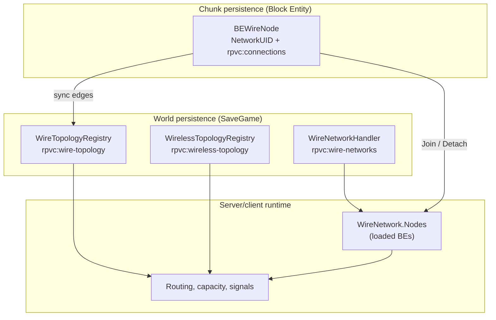
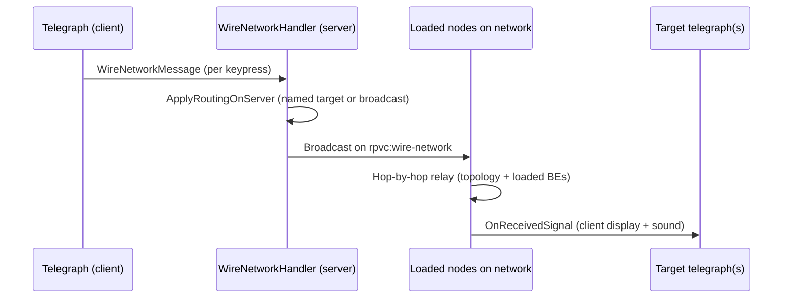
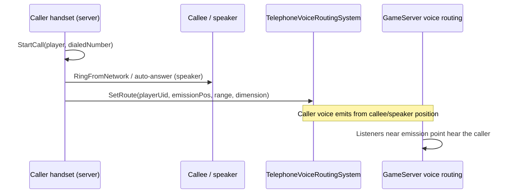

# Communication network architecture (RPVoiceChat)

This document describes how wired and wireless communication networks are modeled, persisted, and executed in the mod.

## Overview

RPVoiceChat deliberately separates **three layers**:

| Layer | Role | Chunk-independent? |
|-------|------|--------------------|
| **Topology** | Who is connected to whom (edges) | Yes (world save) |
| **Network membership** | Which nodes share a `networkId` | Yes (world save) |
| **Runtime** | Loaded block entities, routing, signals | No (chunk load/unload cycle) |

Core idea:

> Block entities are **runtime views** that **join** and **detach** from a world-level persistent graph. An unloaded chunk must **not** corrupt topology or network identity.



---

## Network families

A wired connected component is classified by its active endpoints (`WireNetworkKind`). **Mixed families are forbidden** (enforced at connection time).

| Family | Transport | Primary blocks | Root (`INetworkRoot`) |
|--------|-----------|----------------|------------------------|
| **Telegraph** | Wired Morse packets | `BlockEntityTelegraph` | Yes |
| **Telephone** | Wired + voice routing | `BlockEntityTelephone`, `BlockEntitySpeaker` | Yes (telephone only) |
| **Radio** | Wired backbone + RF overlay | Radio machines, antennas, `ItemRadio` (talkie) | TBD per block |
| **None** | — | Connectors, passive wire nodes | No |

Shared infrastructure on all wired families:

| Role | Block | Notes |
|------|-------|-------|
| **Switchboard** | `BlockEntitySwitchboard` | Power, capacity, named sub-networks |
| **Connector** | `BEConnector` | Passive wire junction |

Capacity and power rules: `WireNetworkTypeRules` + server config (`TelegraphNetworkMaxEndpoints`, `TelephoneNetworkMaxEndpoints`, `RadioNetworkMaxEndpoints`, etc.).

---

## Wired infrastructure

### Network roots (`INetworkRoot`)

`BETelegraph` and `BETelephone` can **create** and **maintain** a `networkId`. A component with no `INetworkRoot` stays infrastructure-only (`NetworkUID = 0`).

### Node lifecycle

```
Chunk load / placement
  → FromTreeAttributes: restore NetworkUID + serialized connections
  → RegisterSerializedTopologyEdges: register edges in WireTopologyRegistry
  → Initialize (server): reconcile NetworkUID from world data, JoinNode

Chunk unload
  → DetachNode: remove BE from WireNetwork.Nodes (persistence unchanged)

Block destroyed
  → RemoveNode: remove BE + PersistedNodes + topology edges
```

Pivot file: `BEWireNode.cs`.

### Key classes

| File | Responsibility |
|------|----------------|
| `WireNetwork.cs` | Runtime graph: `Nodes` (live) + `PersistedNodes` (world) |
| `WireNetworkHandler.cs` | Global registry, UID propagation, capacity, routing |
| `WireTopologyRegistry.cs` | World-level wire edges (`BlockPos` ↔ `BlockPos`) |
| `WireNetworkPersistence.cs` | `SaveGameLoaded` / `GameWorldSave` hooks |
| `WireConnection.cs` | Local edge + copied positions for rendering |
| `WireMesh.cs` | Visual cable rendering (catenary) — **no network logic** |

### World persistence

| SaveGame key | Content |
|--------------|---------|
| `rpvc:wire-topology` | `WireEdge` list (block positions) |
| `rpvc:wire-networks` | Networks: `networkId`, name, `PersistedNodes` |
| `rpvc:wire-network-nextid` | Next allocated ID |

| Chunk key (BE) | Content |
|----------------|---------|
| `rpvc:networkUID` | Network ID |
| `rpvc:connections` | Connected neighbour positions |

**Source of truth** after reload:

1. **Edges** → `WireTopologyRegistry`
2. **Membership** → `WireNetwork.PersistedNodes` + `ResolveNetworkIdForPosition`
3. **Local adjacency** → `rpvc:connections` (resync + rendering)

### `WireNetwork` runtime model

| List | Content | On chunk unload |
|------|---------|-----------------|
| `Nodes` | Loaded `BEWireNode` references | `DetachNode` |
| `PersistedNodes` | `WireNodeRef` (position + `WireNodeKind`) | **kept** |

A network is removed only when **both lists are empty**.

### `WireTopologyRegistry`

World-level wire edges. Exists **even when chunks are unloaded**.

- `AddEdge` / `RemoveEdge` / `GetConnectedComponent` / `GetNeighborPositions`
- Drives UID propagation, split detection, capacity traversal, `GetReachableNodes`

---

## Telegraph networks

### Purpose

Send **Morse character packets** across a wired graph. Each telegraph key is an endpoint that can transmit and receive keyed input.

### How it works



1. **Client** sends `WireNetworkMessage` on channel `rpvc:wire-network` for each keypress (`BETelegraph.SendSignal`).
2. **Server** resolves routing in `ApplyRoutingOnServer`:
   - `WireRouteMode.All` — every telegraph on the network
   - `WireRouteMode.NamedEndpoint` — `ResolveTelegraphByName(networkId, targetName)` → sets `TargetPos`
3. **Relay** is hop-by-hop through **loaded** `BEWireNode` instances (with topology fallback for neighbour discovery).
4. **Receiving telegraphs** update their display and play Morse audio client-side.

### Endpoint identity

- Each telegraph can have a **custom endpoint name** (`CustomEndpointName`), persisted on the block.
- Names must be unique within a network (`IsEndpointNameTaken`).
- Used for switchboard-managed **named routing** (send to `"StationA"` instead of broadcast).

### Switchboard integration

When a telegraph network includes a powered switchboard:

- `RefreshTelegraphRoutingSnapshot` pushes server flags to every telegraph: managed, advanced routing unlocked, disabled reason.
- **Advanced routing** unlocks named targets in the telegraph UI.
- **Power / capacity** gates disable sending when the switchboard cannot supply enough power or the network is over endpoint capacity.

Without a switchboard: telegraph networks work in **broadcast mode** with **unlimited** telegraph endpoints (connection rules in `WireNetworkHandler.CanConnectNodes`).

### Persistence (telegraph-specific chunk data)

- `originalCreatedNetworkID` — stable root ID across splits/reloads
- `customEndpointName` — named routing target
- Routing flags synced from server (`rpvc:routing*`)

---

## Telephone networks

### Purpose

Establish **voice calls** between telephones (and **PA-style** branches to speakers). Voice does **not** travel as `WireNetworkMessage` packets — it uses the **proximity voice engine** with a routing override.

### Topology modes

| Mode | Condition | Behaviour |
|------|-----------|-----------|
| **Direct peer** | No switchboard on component | Up to **2 handsets** on a plain wire network; auto-resolves the other endpoint |
| **Switchboard-managed** | Switchboard present + powered | Handsets dial by **phone number**; capacity from config |
| **PA branch** | Speakers on the same component | Up to **1 handset** when speakers are present; voice routes to speaker emission points |

Speakers (`BlockEntitySpeaker`) are **voice endpoints** but not `INetworkRoot`. They cannot create a network alone. The same speaker block also works on **radio** wired graphs (see [Shared blocks](#shared-blocks-telephone--radio)).

### How a call works



1. **Server** `BETelephone.StartCall` resolves the target:
   - Switchboard mode: find handset by `phoneNumber` on the same `WireNetwork`
   - Direct mode: `TryResolveDirectPeerEndpoint`
   - Speaker branch: `GetReachableTelephoneVoiceEndpoints` → multiple `VoiceRoute`s
2. **Telephone ↔ telephone**: callee must **answer** (`RingFromNetwork` → accept).
3. **Telephone ↔ speaker**: auto-answer; caller voice is rerouted to speaker position(s).
4. **`TelephoneVoiceRoutingSystem`** stores per-player `VoiceRoute`(s). `GameServer` consults `IVoiceRouteProvider` when deciding who hears whom.
5. **End call** clears routes via `ClearRoute(playerUid)`.

### Phone numbers

- Each handset has a persisted `rpvc:phoneNumber`.
- Switchboard-managed dialling matches numbers **within the same wired network**.
- `rpvc:targetNumber` stores UI dial target; call state (`Idle`, `Ringing`, `InCall`) and peer/caller positions are persisted for reload recovery.

### Switchboard integration

Same pattern as telegraph: `ApplyServerComposeFlags` on each telephone — managed, compose enabled, disabled reason (no power / over capacity).

### Persistence (telephone-specific chunk data)

- `rpvc:phoneNumber`, `rpvc:targetNumber`
- `rpvc:telephoneState`, peer/caller positions, caller player UID
- `rpvc:telephoneOriginalCreatedNetworkID`

---

## Radio networks

### Purpose

**Hybrid network**: radio infrastructure is wired; **RF broadcast** is a runtime overlay keyed by **frequency** (defined on the supervision console).

```
                    [Microphone]──┐  (voice input, 1 wire)
                                  │
[Standard]──[Radio Supervision Console]══wire══[Radio Emitter]──[Antenna part]×N
              │  frequency + display name     │  MP power + mode GUI
              │  max 2 wires, 1 per component │  wireless TX when powered
              ╞══wire══[Speaker]  (local audio out)
              │
              └── [Mixing Console] (stub, 1 wire, behaviour TBD)
                         │
                    RF broadcast (frequency, range)
                         │
         [Talkie TX/RX]   [Radio receiver RX-only]   [Emitter repeater mode]
```

### Block roles

| Block | `WireNodeKind` | Max wires | `INetworkRoot` | Role |
|-------|----------------|-----------|----------------|------|
| **Radio Supervision Console** | `RadioConsole` | **2** | **Yes** | Frequency + display name; owns radio `networkId`; **at most one** per component |
| **Radio Emitter** | `RadioEmitter` | default* | No | MP consumer; wireless TX; GUI: wired-source vs repeater |
| **Radio Microphone** | `Radio` | **1** | No | GUI on/off; only the active operator's voice is routed (telephone-style) |
| **Mixing Console** | `Radio` | **2** | No | Program bus (HLS + mic mix); server-side playback |
| **Radio Antenna Part** | — (stack) | — | No | On top of emitter/part only; **+50 blocks** TX range each |
| **Connector / standard** | `Infrastructure` | config | No | Branching |
| **Speaker** | `Infrastructure`* | **1** | No | **Shared** local audio output — telephone PA **or** radio wired graph |
| **Radio Receiver** | — (wireless) | — | No | RF appliance: **receive only** on a tuned frequency |
| **Talkie** (`ItemRadio`) | — (handheld) | — | No | **TX + RX** at very short range (future) |

\* Emitter uses default `TelegraphMaxConnectionsPerNode` unless overridden; repeater mode forbids any wire. Speaker reuses existing **`WireNodeKind.Infrastructure`** (see below).

### Shared blocks (telephone + radio)

**Speaker** (`BlockEntitySpeaker`) is the **same block** on both families — one asset, one recipe, no radio-specific variant.

| On network | Role |
|------------|------|
| **Telephone** | PA branch: during a call, caller voice is rerouted to reachable speakers (`TelephoneVoiceRoutingSystem`) |
| **Radio** | Local playback endpoint on the wired graph; hears audio from the radio station (wired inputs + RF feed, via `RadioVoiceRoutingSystem`) |

Implementation:

- Reuse **`WireNodeKind.Infrastructure`** — already neutral: not counted in `telegraphCount` / `telephoneCount` / `radioCount` (see `WireNetworkHandler.CanConnectNodes` and `WireNetwork.RebuildTypedState`). Same role as connectors and standards.
- `BlockEntitySpeaker` keeps `IsActiveEndpoint => true` and `ITelephoneVoiceEndpoint`; family-specific behaviour is detected by **block type** (`OfType<BlockEntitySpeaker>()`), not by `WireNodeKind`.
- Resolved `WireNetworkKind` comes from the traffic endpoints on the component (handset, supervision console, telegraph key, …).
- Change from today: speaker currently declares `WireNodeKind.Telephone` — that wrongly inflates telephone counts and blocks radio graphs; switch to `Infrastructure` at implementation time.
- Existing telephone rules unchanged: max **1 handset** when speakers are present on a PA branch (still enforced via `OfType<BlockEntitySpeaker>()`).

### Audio inputs (wired radio graph)

The wired radio network needs at least one **sound capture** endpoint before emitters can broadcast meaningful audio.

| Input | Status | Behaviour |
|-------|--------|-----------|
| **Radio Microphone** | Done | GUI **on/off**; only the player who goes **on air** has voice routed to the wired graph + RF (like telephone call routing, not proximity capture). |
| **Mixing Console** | Done | HLS program source (server-side). **Does not capture the radio microphone** — see below. |
| **Radio Microphone** | Done | GUI on/off operator voice on the **same wired graph** in parallel with the mixing console. |
| **Telephone** | Not on radio graph | Telephone handsets create `WireNetworkKind.Telephone` networks. Radio identity is owned by the **supervision console**, not telephone roots. |

Planned interface (mirrors `ITelephoneVoiceEndpoint` for outputs):

```csharp
public interface IRadioVoiceInput
{
    int VoiceCaptureRangeBlocks { get; }
}
```

`RadioVoiceRoutingSystem` will aggregate inputs on the console's wired component and feed powered emitters.

### Radio Supervision Console

- **GUI**: transmission **frequency** (channel id) + **display name** (human label).
- **`INetworkRoot`**: creates and owns the radio `networkId`.
- **Max 2 wire connections** (`MaxConnections => 2`).
- **One console per wired radio component** — enforced in `WireNetworkHandler.CanConnectNodes`.
- Multiple **emitters** may connect on the same graph via connectors/standards.
- Does **not** transmit wirelessly; configures frequency for all wired emitters on that graph.
- Frequency + name persisted on the block entity and synced to affiliated emitters.

### Radio Microphone

- **`MaxConnections => 1`** (same as `BlockEntitySpeaker` / `BlockEntityTelephone`).
- **`WireNodeKind.Radio`** — `WireNetworkKind.Radio`, not telephone.
- **No `INetworkRoot`** — joins the network created by the supervision console.
- **GUI** with **on / off** (go on air / go off air). Closing the GUI does **not** end transmission — same pattern as telephone calls.
- **Single operator**: only the player who enabled transmission has voice routed; another player receives a busy error if the mic is already on air.
- No proximity capture — operator position does not matter once on air.
- `RadioMicCaptureSystem` arms RF + wired speaker routes for the active operator only.

### Mixing Console (program source — HLS)

- Block + block entity registered; single wire; `WireNodeKind.Radio`; implements `IRadioProgramSource`.
- **GUI**: internet **HLS URL** field (http/https) + **on / off air** toggle (single operator, same rules as radio microphone).
- When **on air**, the **dedicated server** pulls the HLS stream via **FFmpeg** (must be installed on the server `PATH`), decodes to PCM, encodes Opus broadcast frames, and injects routed `AudioPacket`s (synthetic source id per console).
- Broadcast **continues 24/7** after the operator goes on air — the operator may disconnect; only **go off air**, breaking the block, or server restart stops playback.
- `RadioProgramBroadcastSystem` arms RF routes and owns one FFmpeg session per on-air mixing console.

#### Mixing console + radio microphone (unified program bus)

When a **mixing console is on air** on the wired graph, it owns the **single program output** for that station:

| Source | Behaviour |
|--------|-----------|
| **HLS URL** | Server FFmpeg decode → music bed |
| **Radio microphone** (same graph, on air) | Operator voice is **not** routed directly; packets are consumed by `RadioProgramBroadcastSystem` |
| **Mix** | Each HLS frame is mixed with queued mic PCM; **music ducks** (~10% level) while the mic is active |

Mic-only is supported: mixing console on air without HLS URL, microphone on air on the same graph → voice on the program bus.

If **no mixing console is on air**, the radio microphone keeps its **direct** RF path (`RadioMicCaptureSystem`).

#### HLS / FFmpeg

| Requirement | Notes |
|-------------|-------|
| Stream URL | Persisted on the mixing console BE; validated server-side (`http://` / `https://`, max 2048 chars) |
| FFmpeg | Bundled optional: `Lib/ffmpeg/{win|linux|osx}/ffmpeg(.exe)` inside the mod folder. Falls back to server `PATH` if absent. LGPL/GPL — see `Lib/ffmpeg/README.txt`. |
| Network | Server must reach the HLS URL (internet access on the host running Vintage Story server) |

Example URL shape: `https://example.com/live/stream.m3u8`

#### Program broadcast vs voice capture

| | **Radio Microphone** | **Mixing Console** |
|---|---------------------|-------------------|
| Trigger | Operator enables mic in **GUI** (on air) | Mixing console **on air** (HLS and/or mic on same graph) |
| Human locuteur | Yes (single designated operator) | Mic operator when mic on same graph; else automated HLS |
| RF routes | Direct mic routes **only if no on-air mixing console** on graph | Single program bus `rpvc:program:…` |
| Wired speakers | Yes | Yes (via program bus) |
| Audio origin | Client `AudioPacket` (operator voice) | Server-mixed program `AudioPacket` |

```csharp
public interface IRadioProgramSource
{
    bool IsOnAir { get; }
    string HlsStreamUrl { get; }
    string ActiveOperatorPlayerUid { get; }
}
```


### Radio Emitter

**Mechanical power** (same pattern as `BlockEntitySwitchboard` / `BlockEntityBellHammer`):

- `MPConsumer` + `IMechanicalPowerBlock`
- Reads `TrueSpeed` server-side; wireless TX active when `PowerPercent >= RadioNetworkMinPowerPercent` (default 50%, server config)

**Wireless range** (runtime, server config):

```
effectiveRange = RadioEmitterBaseRangeBlocks + (antennaPartCount × RadioAntennaPartRangeBonusBlocks)
```

| Config key | Default |
|------------|---------|
| `RadioEmitterBaseRangeBlocks` | 100 |
| `RadioAntennaPartRangeBonusBlocks` | 50 |

When powered, the emitter broadcasts **voice/audio from the network** at `effectiveRange` on the console's frequency.

**Operating mode** (GUI, persisted):

| Mode | Wired connection | Behaviour |
|------|------------------|-----------|
| **Wired source** | Allowed | Retransmits audio from **wired inputs** (mic, mixing console, …) and **local speakers** on the same graph |
| **Repeater** | **Forbidden** | Listens to another **powered emitter** on a receivable frequency within range and re-broadcasts that channel; prevents mixing wired radio networks |

Mode is enforced at connection time: repeater emitters reject new wire connections.

### Radio Antenna Parts (stackable)

Inspired by vertical windmill sail stacking ([millwright](https://github.com/SpearAndFang/millwright)):

- Separate block placed **only on top of** a radio emitter or another antenna part.
- Forms a vertical chain; the **base emitter** counts segments for range bonus.
- Placement validation on interact/place (scan obstruction optional, same idea as millwright `Obstructed`).
- Destroying a segment updates the chain and recalculates range.

Not a wire node — purely structural range extension on the emitter below.

### Wired layer rules (`WireNetwork`)

| Rule | Detail |
|------|--------|
| Network root | **`RadioConsole`** implements `INetworkRoot` (one `networkId` per radio station) |
| Console limit | **1** `RadioConsole` per connected component |
| Console wires | **Max 2** connections on the supervision console |
| Single-wire endpoints | Microphone, speaker: **`MaxConnections => 1`**; mixing console: **`MaxConnections => 2`** |
| Speaker | **`WireNodeKind.Infrastructure`** — valid on telephone **and** radio components |
| Emitters | Multiple `RadioEmitter` nodes allowed on the same graph |
| Repeater emitter | **No** wire connections |
| Wired-source emitter | Wire + connectors + standards |
| Switchboard (optional) | Same power/capacity pattern as other families |
| Family typing | Component with radio endpoints → `WireNetworkKind.Radio` |
| Mixed families | Radio and telephone/telegraph endpoints cannot share a component (existing guard) |

### Wireless receivers and talkies

| Device | TX | RX | Range | Notes |
|--------|----|----|-------|-------|
| **Talkie** (`ItemRadio`) | Yes | Yes | Very short (server config `RadioTalkieRangeBlocks`, TBD) | Handheld; tune to console frequency; bind via `WirelessTopologyRegistry` |
| **Radio Receiver** (block) | No | Yes | Configurable listen radius (`RadioReceiverRangeBlocks`, TBD) | Fixed appliance; GUI: frequency tune + volume; no mechanical power required (TBD) |
| **Radio Emitter** | Yes | No* | `base + antenna parts` | *Repeater mode receives another emitter's RF, then re-transmits |

Receivers filter by **frequency** (and optionally display name in GUI). They do not join the wired graph.

### Wireless layer (`WirelessTopologyRegistry`)

Extended for frequency-aware channels:

| Mechanism | Use |
|-----------|-----|
| `RegisterAntenna(pos, networkId)` | Emitter affiliated to wired network |
| Frequency binding | Console frequency applied to all wired emitters on the graph |
| `BindTalkie(playerUid, networkId)` / frequency tune | Handheld reception (future `ItemRadio`) |
| Repeater | Runtime only: scan powered emitters in range on target frequency |

SaveGame key: `rpvc:wireless-topology`.

### Voice and range (runtime)

Not stored in topology registries:

- Effective TX range (base + antenna parts)
- Mechanical power gate
- Frequency reception filter
- Line-of-sight / occlusion (future)

Planned routing: dedicated `RadioVoiceRoutingSystem` (same hook pattern as `TelephoneVoiceRoutingSystem` → `GameServer` / `IVoiceRouteProvider`).

### Server config (radio)

| Key | Default | Notes |
|-----|---------|-------|
| `RadioNetworkMinPowerPercent` | 50 | Min MP speed for wireless TX |
| `RadioNetworkMaxEndpoints` | 16 | Per switchboard, emitters count |
| `RadioEmitterBaseRangeBlocks` | 100 | Base wireless TX range |
| `RadioAntennaPartRangeBonusBlocks` | 50 | Per stacked antenna part |
| `RadioMicrophoneCaptureDistance` | 2 | Proximity capture at radio microphone |
| `RadioTalkieRangeBlocks` | 16 | Handheld TX/RX radius |
| `RadioReceiverRangeBlocks` | 64 | Fixed receiver listen radius |

No in-game command required (same pattern as `SpeakerAudibleDistance`, etc.).

### Implementation status

| Component | Status |
|-----------|--------|
| `WirelessTopologyRegistry`, world persistence | Done |
| `WireNodeKind` radio family + connection rules | Done |
| `BESpeaker` → `WireNodeKind.Infrastructure` | Done |
| Server config radio range keys | Done |
| Radio Supervision Console | Done |
| Radio Microphone + GUI on/off operator capture | Done |
| Radio Emitter (MP, modes, antenna range) | Done |
| Radio Antenna Part (stack placement) | Done |
| Mixing Console (stub BE) | Done |
| Radio Receiver block (GUI tune) | Done |
| RF wired TX (`RadioRfTransmissionService`, repeater relay) | Done |
| RF reception — talkie (`RadioRfReceptionSystem`) | Done |
| RF reception — fixed receiver (`RadioReceiverReceptionSystem`) | Done |
| `ItemRadio` talkie (PTT + tune GUI) | Done |
| Mixing console — HLS program broadcast (server-side) | Done (FFmpeg on dedicated server) |

### Classes (existing + planned)

| File | Role |
|------|------|
| `RadioNetwork.cs` | Radio family on `CommunicationNetworkBase` |
| `WirelessTopologyRegistry.cs` | RF overlay persistence |
| `BlockEntityRadioSupervisionConsole.cs` | Console BE — `INetworkRoot`, 2 wires (planned) |
| `BlockEntityRadioMicrophone.cs` | Mic input BE (planned) |
| `BlockEntityRadioMixingConsole.cs` | Mixing console stub (planned) |
| `BlockEntityRadioEmitter.cs` | Emitter BE (planned) |
| `BlockEntityRadioAntennaPart.cs` | Stack segment BE (planned) |
| `BlockEntityRadioReceiver.cs` | RX-only appliance BE (planned) |
| `RadioVoiceRoutingSystem.cs` | Mic + talkie route layers → `GameServer` |
| `RadioRfTransmissionService.cs` | Wired TX points + repeater relay |
| `RadioRfReceptionSystem.cs` | Talkie RX expander |
| `RadioReceiverReceptionSystem.cs` | Fixed receiver listen zone |
| `RadioTalkieTransmissionSystem.cs` | Talkie PTT TX routes |
| `RadioBlockIndex.cs` | Server-side radio BE index |
| `RadioProgramBroadcastSystem.cs` | Server HLS decode + RF routes + audio inject |
| `RadioProgramMixer.cs` | Music + mic mix with voice ducking |
| `RadioProgramMicBuffer.cs` | Mic PCM queue for program bus |
| `RadioHlsStreamCapture.cs` | FFmpeg pipe decoder |
| `ItemRadio.cs` | Handheld talkie (short TX/RX) |

---

## Switchboard (shared)

`BlockEntitySwitchboard` sits on the wired graph as `WireNodeKind.Switchboard`.

Responsibilities across **telegraph**, **telephone**, and **radio**:

- **Power gate** — `HasSufficientPowerFor(WireNetworkKind)` per family
- **Capacity multiplier** — `MaxEndpoints × switchboardCount`
- **Nearest-owner resolution** — BFS on world topology assigns each endpoint to the closest switchboard
- **Custom network name** — persisted on the switchboard block and in `WireNetwork.CustomName`

When no switchboard is present, telegraph/telephone/radio fall back to simpler rules documented above.

---

## Signal propagation (wired)

All wired **data** signals (telegraph Morse) relay **hop-by-hop** through loaded nodes. World topology guarantees **network identity and membership** survive chunk unload; an unloaded connector does not relay in real time, but the network reconstitutes correctly on reload.

Telephone **voice** bypasses wire packets entirely and uses `TelephoneVoiceRoutingSystem` → `GameServer` voice routing.

---

## Files to read first

1. `src/Systems/WireNetworkPersistence.cs`
2. `src/Systems/WireTopologyRegistry.cs`
3. `src/Systems/WireNetwork.cs`
4. `src/Systems/WireNetworkHandler.cs`
5. `src/BlockEntity/BEWireNode.cs`
6. `src/BlockEntity/BETelegraph.cs`
7. `src/BlockEntity/BETelephone.cs`
8. `src/Systems/TelephoneVoiceRoutingSystem.cs`
9. `src/Systems/WirelessTopologyRegistry.cs`
10. `src/Systems/RadioNetwork.cs`
