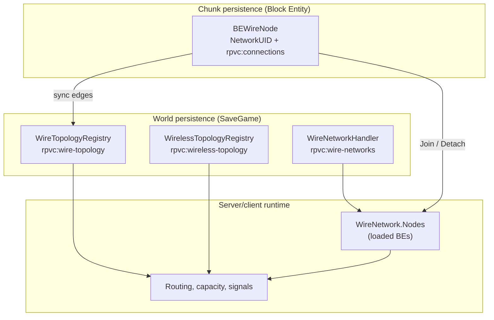
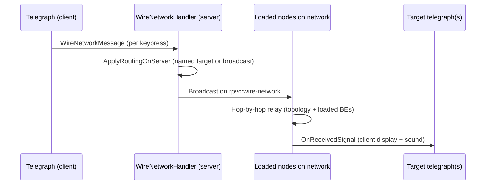
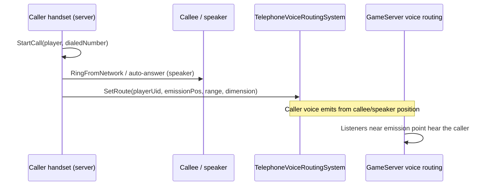

# Communication network architecture (RPVoiceChat)

This document describes how wired and wireless communication networks are modeled, persisted, and executed in the mod.

## Overview

RPVoiceChat deliberately separates **three layers**:

| Layer | Role | Chunk-independent? |
|-------|------|--------------------|
| **Topology** | Who is connected to whom (edges) | Yes (world save) |
| **Network membership** | Which nodes share a `networkId` | Yes (world save) |
| **Runtime** | Loaded block entities, routing, signals | No (chunk load/unload cycle) |

Core idea:

> Block entities are **runtime views** that **join** and **detach** from a world-level persistent graph. An unloaded chunk must **not** corrupt topology or network identity.



---

## Network families

A wired connected component is classified by its active endpoints (`WireNetworkKind`). **Mixed families are forbidden** (enforced at connection time).

| Family | Transport | Primary blocks | Root (`INetworkRoot`) |
|--------|-----------|----------------|------------------------|
| **Telegraph** | Wired Morse packets | `BlockEntityTelegraph` | Yes |
| **Telephone** | Wired + voice routing | `BlockEntityTelephone`, `BlockEntitySpeaker` | Yes (telephone only) |
| **Radio** | Wired backbone + RF overlay | Radio machines, antennas, `ItemRadio` (talkie) | TBD per block |
| **None** | — | Connectors, passive wire nodes | No |

Shared infrastructure on all wired families:

| Role | Block | Notes |
|------|-------|-------|
| **Switchboard** | `BlockEntitySwitchboard` | Power, capacity, named sub-networks |
| **Connector** | `BEConnector` | Passive wire junction |

Capacity and power rules: `WireNetworkTypeRules` + server config (`TelegraphNetworkMaxEndpoints`, `TelephoneNetworkMaxEndpoints`, `RadioNetworkMaxEndpoints`, etc.).

---

## Wired infrastructure

### Network roots (`INetworkRoot`)

`BETelegraph` and `BETelephone` can **create** and **maintain** a `networkId`. A component with no `INetworkRoot` stays infrastructure-only (`NetworkUID = 0`).

### Node lifecycle

```
Chunk load / placement
  → FromTreeAttributes: restore NetworkUID + serialized connections
  → RegisterSerializedTopologyEdges: register edges in WireTopologyRegistry
  → Initialize (server): reconcile NetworkUID from world data, JoinNode

Chunk unload
  → DetachNode: remove BE from WireNetwork.Nodes (persistence unchanged)

Block destroyed
  → RemoveNode: remove BE + PersistedNodes + topology edges
```

Pivot file: `BEWireNode.cs`.

### Key classes

| File | Responsibility |
|------|----------------|
| `WireNetwork.cs` | Runtime graph: `Nodes` (live) + `PersistedNodes` (world) |
| `WireNetworkHandler.cs` | Global registry, UID propagation, capacity, routing |
| `WireTopologyRegistry.cs` | World-level wire edges (`BlockPos` ↔ `BlockPos`) |
| `WireNetworkPersistence.cs` | `SaveGameLoaded` / `GameWorldSave` hooks |
| `WireConnection.cs` | Local edge + copied positions for rendering |
| `WireMesh.cs` | Visual cable rendering (catenary) — **no network logic** |

### World persistence

| SaveGame key | Content |
|--------------|---------|
| `rpvc:wire-topology` | `WireEdge` list (block positions) |
| `rpvc:wire-networks` | Networks: `networkId`, name, `PersistedNodes` |
| `rpvc:wire-network-nextid` | Next allocated ID |

| Chunk key (BE) | Content |
|----------------|---------|
| `rpvc:networkUID` | Network ID |
| `rpvc:connections` | Connected neighbour positions |

**Source of truth** after reload:

1. **Edges** → `WireTopologyRegistry`
2. **Membership** → `WireNetwork.PersistedNodes` + `ResolveNetworkIdForPosition`
3. **Local adjacency** → `rpvc:connections` (resync + rendering)

### `WireNetwork` runtime model

| List | Content | On chunk unload |
|------|---------|-----------------|
| `Nodes` | Loaded `BEWireNode` references | `DetachNode` |
| `PersistedNodes` | `WireNodeRef` (position + `WireNodeKind`) | **kept** |

A network is removed only when **both lists are empty**.

### `WireTopologyRegistry`

World-level wire edges. Exists **even when chunks are unloaded**.

- `AddEdge` / `RemoveEdge` / `GetConnectedComponent` / `GetNeighborPositions`
- Drives UID propagation, split detection, capacity traversal, `GetReachableNodes`

---

## Telegraph networks

### Purpose

Send **Morse character packets** across a wired graph. Each telegraph key is an endpoint that can transmit and receive keyed input.

### How it works



1. **Client** sends `WireNetworkMessage` on channel `rpvc:wire-network` for each keypress (`BETelegraph.SendSignal`).
2. **Server** resolves routing in `ApplyRoutingOnServer`:
   - `WireRouteMode.All` — every telegraph on the network
   - `WireRouteMode.NamedEndpoint` — `ResolveTelegraphByName(networkId, targetName)` → sets `TargetPos`
3. **Relay** is hop-by-hop through **loaded** `BEWireNode` instances (with topology fallback for neighbour discovery).
4. **Receiving telegraphs** update their display and play Morse audio client-side.

### Endpoint identity

- Each telegraph can have a **custom endpoint name** (`CustomEndpointName`), persisted on the block.
- Names must be unique within a network (`IsEndpointNameTaken`).
- Used for switchboard-managed **named routing** (send to `"StationA"` instead of broadcast).

### Switchboard integration

When a telegraph network includes a powered switchboard:

- `RefreshTelegraphRoutingSnapshot` pushes server flags to every telegraph: managed, advanced routing unlocked, disabled reason.
- **Advanced routing** unlocks named targets in the telegraph UI.
- **Power / capacity** gates disable sending when the switchboard cannot supply enough power or the network is over endpoint capacity.

Without a switchboard: telegraph networks work in **broadcast mode** with **unlimited** telegraph endpoints (connection rules in `WireNetworkHandler.CanConnectNodes`).

### Persistence (telegraph-specific chunk data)

- `originalCreatedNetworkID` — stable root ID across splits/reloads
- `customEndpointName` — named routing target
- Routing flags synced from server (`rpvc:routing*`)

---

## Telephone networks

### Purpose

Establish **voice calls** between telephones (and **PA-style** branches to speakers). Voice does **not** travel as `WireNetworkMessage` packets — it uses the **proximity voice engine** with a routing override.

### Topology modes

| Mode | Condition | Behaviour |
|------|-----------|-----------|
| **Direct peer** | No switchboard on component | Up to **2 handsets** on a plain wire network; auto-resolves the other endpoint |
| **Switchboard-managed** | Switchboard present + powered | Handsets dial by **phone number**; capacity from config |
| **PA branch** | Speakers on the same component | Up to **1 handset** when speakers are present; voice routes to speaker emission points |

Speakers (`BlockEntitySpeaker`) are **voice endpoints** but not `INetworkRoot`. They cannot create a network alone.

### How a call works



1. **Server** `BETelephone.StartCall` resolves the target:
   - Switchboard mode: find handset by `phoneNumber` on the same `WireNetwork`
   - Direct mode: `TryResolveDirectPeerEndpoint`
   - Speaker branch: `GetReachableTelephoneVoiceEndpoints` → multiple `VoiceRoute`s
2. **Telephone ↔ telephone**: callee must **answer** (`RingFromNetwork` → accept).
3. **Telephone ↔ speaker**: auto-answer; caller voice is rerouted to speaker position(s).
4. **`TelephoneVoiceRoutingSystem`** stores per-player `VoiceRoute`(s). `GameServer` consults `IVoiceRouteProvider` when deciding who hears whom.
5. **End call** clears routes via `ClearRoute(playerUid)`.

### Phone numbers

- Each handset has a persisted `rpvc:phoneNumber`.
- Switchboard-managed dialling matches numbers **within the same wired network**.
- `rpvc:targetNumber` stores UI dial target; call state (`Idle`, `Ringing`, `InCall`) and peer/caller positions are persisted for reload recovery.

### Switchboard integration

Same pattern as telegraph: `ApplyServerComposeFlags` on each telephone — managed, compose enabled, disabled reason (no power / over capacity).

### Persistence (telephone-specific chunk data)

- `rpvc:phoneNumber`, `rpvc:targetNumber`
- `rpvc:telephoneState`, peer/caller positions, caller player UID
- `rpvc:telephoneOriginalCreatedNetworkID`

---

## Radio networks

### Purpose

**Hybrid network**: radio **machines** are wired into the normal graph; **antennas** (blocks) and **talkies** (players) attach via an **RF overlay** that shares the same `networkId`.

```
[Switchboard]──wire──[Radio hub machine]──wire──[Connector]
                         │
                    RF overlay (WirelessTopologyRegistry)
                         │
              [Antenna block]     [Player talkie (ItemRadio)]
```

### Wired layer (radio family on `WireNetwork`)

Radio machines are `BEWireNode` endpoints with `WireNodeKind.Radio`. The component is typed `WireNetworkKind.Radio`.

Connection rules (`WireNetworkHandler.CanConnectNodes`):

| Setup | Rule |
|-------|------|
| No switchboard | At most **1** radio endpoint |
| With switchboard | Up to `RadioNetworkMaxEndpoints` × switchboard count; requires `RadioNetworkMinPowerPercent` power |

Radio endpoints participate in the same persistence model as other wired nodes (`PersistedNodes`, `WireTopologyRegistry`, Join/Detach).

### Wireless layer (`WirelessTopologyRegistry`)

RF is modeled separately from physical wires:

| Mechanism | API | Use case |
|-----------|-----|----------|
| **Network affiliation** | `RegisterAntenna(pos, networkId)`, `BindTalkie(playerUid, networkId)` | Durable membership |
| **Explicit RF link** | `LinkWireless(antennaRef, talkieRef)` | Point-to-point pairing |
| **Wired bridge** | `ResolveNetworkIdFromWiredBlock(pos)` | Inherit `networkId` from wired radio hub |

SaveGame key: `rpvc:wireless-topology` (RF links + memberships).

`TopologyNodeRef` identities:

- `block:x|y|z` — antenna, radio hub
- `player:uid` — handheld talkie
- `entity:id` — future mobile devices

### Voice and range (runtime)

These are **not** stored in the topology registry:

- Antenna ↔ talkie **range** and line-of-sight
- Signal quality, occlusion
- Actual voice packet delivery over RF

The registry holds **durable affiliations**; range checks run at call time when radio voice routing is implemented on top of `RadioNetwork` (`NetworkTransportType.Radio`).

### Classes

| File | Role |
|------|------|
| `RadioNetwork.cs` | Radio family on `CommunicationNetworkBase` |
| `WirelessTopologyRegistry.cs` | RF overlay persistence and queries |
| `CommunicationTopologyGraph.cs` | Generic graph engine (wired + wireless links) |
| `TopologyNodeRef.cs` | Block / player / entity node identity |
| `ItemRadio.cs` | Handheld talkie item (gameplay hook) |

---

## Switchboard (shared)

`BlockEntitySwitchboard` sits on the wired graph as `WireNodeKind.Switchboard`.

Responsibilities across **telegraph**, **telephone**, and **radio**:

- **Power gate** — `HasSufficientPowerFor(WireNetworkKind)` per family
- **Capacity multiplier** — `MaxEndpoints × switchboardCount`
- **Nearest-owner resolution** — BFS on world topology assigns each endpoint to the closest switchboard
- **Custom network name** — persisted on the switchboard block and in `WireNetwork.CustomName`

When no switchboard is present, telegraph/telephone/radio fall back to simpler rules documented above.

---

## Signal propagation (wired)

All wired **data** signals (telegraph Morse) relay **hop-by-hop** through loaded nodes. World topology guarantees **network identity and membership** survive chunk unload; an unloaded connector does not relay in real time, but the network reconstitutes correctly on reload.

Telephone **voice** bypasses wire packets entirely and uses `TelephoneVoiceRoutingSystem` → `GameServer` voice routing.

---

## Files to read first

1. `src/Systems/WireNetworkPersistence.cs`
2. `src/Systems/WireTopologyRegistry.cs`
3. `src/Systems/WireNetwork.cs`
4. `src/Systems/WireNetworkHandler.cs`
5. `src/BlockEntity/BEWireNode.cs`
6. `src/BlockEntity/BETelegraph.cs`
7. `src/BlockEntity/BETelephone.cs`
8. `src/Systems/TelephoneVoiceRoutingSystem.cs`
9. `src/Systems/WirelessTopologyRegistry.cs`
10. `src/Systems/RadioNetwork.cs`
